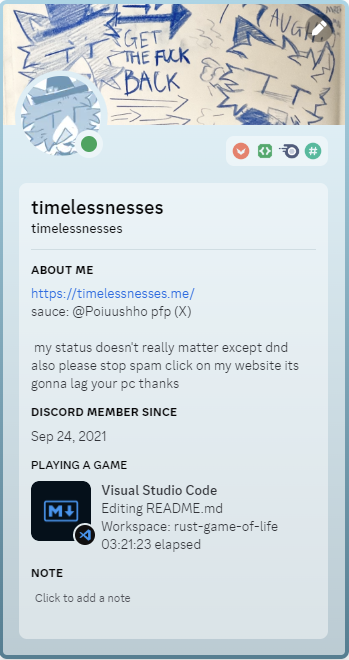

# Conway's Game Of Life in Rust (mobile)

A SDL2 game that simulates Conway's Game of Life. With under 200 lines of code from a Rust noob!

## Building

Install `cargo-vcpkg` and do `cargo vcpkg -v build` then `cargo build -r` to build binary with bundled extension.

## How long did this took

3 hours actually.  

## State

giving up. rust linking sdl2 in android is miserable
